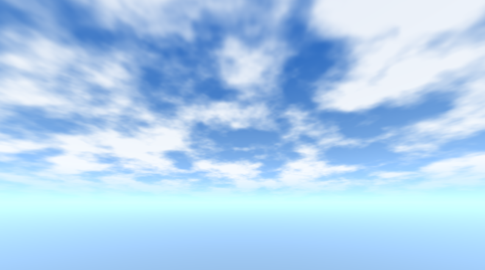

# Cloudy Sky 3D - Godot Sky Shader

A lightweight, high-performance, and professional-grade procedural 3D sky shader designed specifically for **Godot 4**. Perfect for low-end hardware (optimized for 2GB–4GB RAM systems) without sacrificing visual quality!

## 📸 Preview

### Day Sky (Dynamic FBM Clouds & Gradient)

### Night Sky (Voronoi Stars & Twinkle Effect)

---

## ✨ Features

* **Vertical Color Gradient:** Smooth transition with customizable horizon glow.
* **Procedural FBM Clouds:** Optimized 2-octave clouds with fluid movement tied to speed parameters.
* **Smart Time-Wrapping:** Uses `mod(TIME, ...)` to entirely prevent floating-point precision loss and stuttering on long-running scenes.
* **Voronoi Starfield:** Realistic procedural star generation using cell-based hashing to avoid grid patterns.
* **Twinkle Effect:** Dynamic sparkling stars for an immersive night atmosphere.
* **Performance Toggle (`enable_stars`):** Complete boolean toggle to bypass intensive star math entirely when disabled, ensuring high FPS on weaker PCs.

---

## 🚀 Installation

1. Download or clone this repository.
2. Copy the `addons/cloudy_sky_3d` folder directly into your Godot project's root directory.
3. Enable the plugin via **Project -> Project Settings -> Plugins** (optional), or use the shader resource directly.

---

## ⚙️ How to Use

1. Add a **WorldEnvironment** node to your scene.
2. Create a new **Environment** resource in the Inspector.
3. Under the **Background** section, set the mode to **Custom Sky**.
4. Create a new **Sky** material and assign the `cloud_sky.gdshader` shader to it.
5. Adjust parameters like cloud speed, coverage, and toggle stars on/off directly from the Inspector!

---

## 📄 License

This project is open-source and available under the [MIT License](LICENSE).
